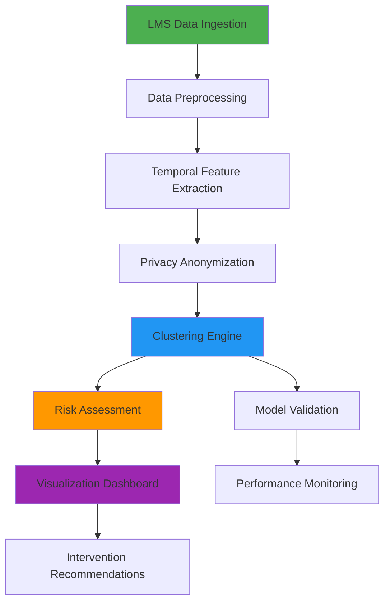

# 🎓 Student Performance Pattern Clustering System

<div align="center"> [](https://github.com/yourusername/student-performance-clustering)[](https://claude.ai/chat/LICENSE)[](https://claude.ai/chat/de6a77c4-512d-4298-8bff-5a071aa1a557#-features)[](https://claude.ai/chat/de6a77c4-512d-4298-8bff-5a071aa1a557#-privacy--security)

**An intelligent analytics platform leveraging unsupervised machine learning to identify at-risk learners through temporal behavioral analysis**

[Features](https://claude.ai/chat/de6a77c4-512d-4298-8bff-5a071aa1a557#-features) • [Architecture](https://claude.ai/chat/de6a77c4-512d-4298-8bff-5a071aa1a557#-architecture) • [Installation](https://claude.ai/chat/de6a77c4-512d-4298-8bff-5a071aa1a557#-installation) • [Usage](https://claude.ai/chat/de6a77c4-512d-4298-8bff-5a071aa1a557#-usage) • [Documentation](https://claude.ai/chat/de6a77c4-512d-4298-8bff-5a071aa1a557#-documentation)

</div> ---

 ---## 🌟 Overview

The Student Performance Pattern Clustering System is a comprehensive analytics platform that transforms LMS interaction data into actionable insights. By analyzing time-varying behavioral patterns, the system proactively identifies students who may need academic intervention, enabling educators to provide timely support.

### 🎯 Key Capabilities

* **🔍 Behavioral Analytics**: Advanced temporal pattern recognition in student engagement
* **🤖 Unsupervised Learning**: Automatic discovery of behavioral clusters without labeled data
* **⚡ Early Detection**: Proactive identification of at-risk students before academic failure
* **🔒 Privacy-First**: Built-in anonymization and differential privacy compliance
* **📊 Real-Time Insights**: Dynamic dashboards and intervention recommendations
* **🎪 Multi-Algorithm Support**: K-Means, DBSCAN, GMM, and Hierarchical Clustering

---

## ✨ Features

### 📈 Temporal Feature Engineering

* Login frequency and session duration analysis
* Activity pattern detection across time periods
* Trend identification and seasonality extraction
* Anomaly detection for unusual behavioral shifts

### 🧮 Clustering Engine

```python
Supported Algorithms:
├── K-Means: Fast, spherical clusters
├── DBSCAN: Density-based, noise-resistant
├── Gaussian Mixture Models: Probabilistic assignment
└── Hierarchical: Nested cluster structures
```

### 🎯 Risk Assessment

* **Low Risk**: Consistent engagement, positive trends
* **Medium Risk**: Declining patterns, irregular behavior
* **High Risk**: Minimal engagement, critical indicators

### 🛡️ Privacy & Security

* K-anonymity for demographic protection
* Differential privacy with configurable ε
* Comprehensive audit logging
* Role-based access control

---

## 🏗️ Architecture



### 🧩 Core Components


| Component               | Purpose                          | Key Technologies                           |
| ----------------------- | -------------------------------- | ------------------------------------------ |
| **Data Ingestion**      | LMS data extraction & validation | REST APIs, ETL pipelines                   |
| **Feature Engineering** | Temporal pattern extraction      | Time-series analysis, Statistical modeling |
| **Clustering Engine**   | Behavioral pattern discovery     | Scikit-learn, NumPy, Pandas                |
| **Risk Assessment**     | Student risk classification      | ML inference, Statistical scoring          |
| **Privacy Layer**       | Data anonymization & compliance  | Differential privacy, K-anonymity          |
| **Monitoring**          | Model performance tracking       | Metrics evaluation, Auto-retraining        |

---

## 🚀 Installation

### Prerequisites

```bash
Python 3.8+
Node.js 16+
PostgreSQL 13+
```

### Quick Start

1️⃣ **Clone the repository**

```bash
git clone https://github.com/yourusername/student-performance-clustering.git
cd student-performance-clustering
```

2️⃣ **Install dependencies**

```bash
# Backend (Python)
pip install -r requirements.txt

# Frontend (Optional)
npm install
```

3️⃣ **Configure environment**

```bash
cp .env.example .env
# Edit .env with your configuration
```

4️⃣ **Initialize database**

```bash
python manage.py migrate
python manage.py seed_initial_data
```

5️⃣ **Run the system**

```bash
# Start backend services
python manage.py runserver

# Start clustering engine
python -m services.clustering_engine

# Start frontend (optional)
npm run dev
```

---

## 💻 Usage

### Running Clustering Analysis

```python
from services.clustering_engine import ClusteringEngine
from services.feature_extractor import TemporalFeatureExtractor

# Initialize components
extractor = TemporalFeatureExtractor()
engine = ClusteringEngine(algorithm='kmeans', n_clusters=4)

# Extract features from LMS data
features = extractor.extract_temporal_features(student_data)

# Perform clustering
clusters = engine.perform_clustering(features)

# Generate risk assessments
risk_assessments = engine.assign_risk_levels(clusters)
```

### API Endpoints

```http
POST   /api/v1/clustering/analyze        # Trigger clustering analysis
GET    /api/v1/clusters/{cluster_id}     # Retrieve cluster details
GET    /api/v1/students/{id}/risk        # Get student risk assessment
POST   /api/v1/interventions             # Create intervention record
GET    /api/v1/reports/performance       # Model performance metrics
```

### Configuration

```yaml
clustering:
  algorithm: 'kmeans'  # kmeans, dbscan, gmm, hierarchical
  n_clusters: 4
  max_iterations: 300
  
privacy:
  anonymization: true
  differential_privacy: true
  epsilon: 0.1
  
notifications:
  enabled: true
  notification_delay_hours: 24
  
validation:
  min_silhouette_score: 0.5
  bootstrap_iterations: 100
```

---

## 📊 Data Models

### Student Behavioral Profile

```typescript
interface StudentBehavioralProfile {
  student_pseudonym: string;
  temporal_features: Record<string, number>;
  cluster_assignment: number;
  risk_level: 'LOW' | 'MEDIUM' | 'HIGH';
  confidence_score: number;
  last_updated: Date;
  intervention_history: InterventionRecord[];
}
```

### Clustering Model

```typescript
interface ClusteringModel {
  algorithm_type: string;
  parameters: Record<string, any>;
  feature_weights: Record<string, number>;
  cluster_centers: number[][];
  validation_metrics: ValidationMetrics;
  training_timestamp: Date;
}
```

---

## 🧪 Testing

```bash
# Run unit tests
pytest tests/unit/

# Run integration tests
pytest tests/integration/

# Run privacy compliance tests
pytest tests/privacy/

# Run performance benchmarks
pytest tests/performance/ --benchmark

# Generate coverage report
pytest --cov=. --cov-report=html
```

---

## 📚 Documentation

* [📖 Full Documentation](https://claude.ai/chat/docs/README.md)
* [🏛️ Architecture Guide](https://claude.ai/chat/docs/architecture.md)
* [🔧 API Reference](https://claude.ai/chat/docs/api.md)
* [🔐 Privacy & Security](https://claude.ai/chat/docs/privacy.md)
* [📊 Model Validation](https://claude.ai/chat/docs/validation.md)
* [🚀 Deployment Guide](https://claude.ai/chat/docs/deployment.md)

---

## 🤝 Contributing

We welcome contributions! Please see our [Contributing Guidelines](https://claude.ai/chat/CONTRIBUTING.md) for details.

1. Fork the repository
2. Create your feature branch (`git checkout -b feature/AmazingFeature`)
3. Commit your changes (`git commit -m 'Add some AmazingFeature'`)
4. Push to the branch (`git push origin feature/AmazingFeature`)
5. Open a Pull Request

---

## 📋 Roadmap

* [X]  Core clustering engine implementation
* [X]  Privacy anonymization layer
* [X]  Risk assessment module
* [ ]  Real-time streaming analytics
* [ ]  Advanced visualization dashboard
* [ ]  Mobile application for instructors
* [ ]  Integration with major LMS platforms (Canvas, Moodle, Blackboard)
* [ ]  Predictive modeling for long-term outcomes
* [ ]  Natural language processing for forum analysis

---

## 📄 License

This project is licensed under the MIT License - see the [LICENSE](https://claude.ai/chat/LICENSE) file for details.

---

## 🙏 Acknowledgments

* Built with [Scikit-learn](https://scikit-learn.org/) for machine learning
* Powered by [NumPy](https://numpy.org/) and [Pandas](https://pandas.pydata.org/)
* Privacy implementations based on [Differential Privacy](https://www.microsoft.com/en-us/research/publication/differential-privacy/)

---

## 📧 Contact

**Project Maintainer**: Your Name
**Email**: your.email@example.com
**GitHub**: [@yourusername](https://github.com/yourusername)

---

<div align="center"> **Made with ❤️ for improving student outcomes**

⭐ Star us on GitHub — it helps!

[Report Bug](https://github.com/yourusername/student-performance-clustering/issues) • [Request Feature](https://github.com/yourusername/student-performance-clustering/issues)

</div>
