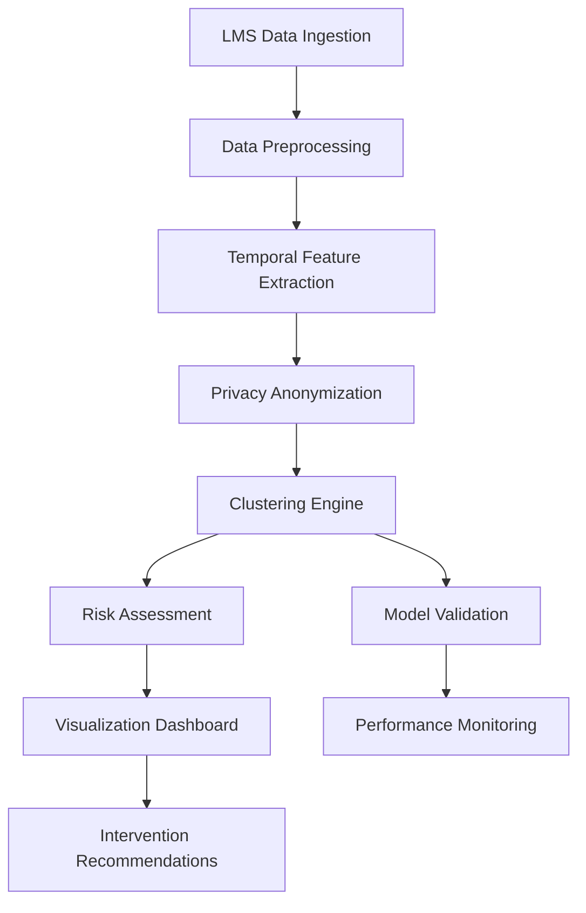

# Requirements Document


## Introduction

  

This feature implements a student performance pattern clustering system that uses unsupervised learning to analyze time-varying LMS interactions and identify at-risk learners. The system will perform chrono behavioral analytics modeling to detect patterns in student engagement and academic performance, enabling proactive academic interventions.

  

## Requirements

  

### Requirement 1

  

**User Story:** As an academic administrator, I want to automatically identify at-risk students through behavioral pattern analysis, so that I can implement timely interventions to improve student outcomes.

  

#### Acceptance Criteria

  

1. WHEN the system analyzes student LMS interaction data THEN it SHALL identify distinct behavioral clusters using unsupervised learning algorithms

2. WHEN behavioral clusters are identified THEN the system SHALL classify students into risk categories (low, medium, high risk)

3. WHEN a student is classified as high-risk THEN the system SHALL generate actionable intervention recommendations

4. IF insufficient interaction data exists for a student THEN the system SHALL flag them for manual review

  

### Requirement 2

  

**User Story:** As a data analyst, I want to process time-varying LMS interaction data, so that I can capture temporal patterns in student behavior.

  

#### Acceptance Criteria

  

1. WHEN processing LMS data THEN the system SHALL extract temporal features including login frequency, session duration, and activity patterns

2. WHEN analyzing time-series data THEN the system SHALL identify trends, seasonality, and anomalies in student behavior

3. WHEN feature extraction is complete THEN the system SHALL normalize temporal features for clustering analysis

4. IF data quality issues are detected THEN the system SHALL log warnings and apply appropriate data cleaning procedures

  

### Requirement 3

  

**User Story:** As an instructor, I want to view student clustering results and risk assessments, so that I can prioritize my intervention efforts effectively.

  

#### Acceptance Criteria

  

1. WHEN clustering analysis is complete THEN the system SHALL provide visualizations of student clusters and their characteristics

2. WHEN viewing cluster results THEN the system SHALL display key behavioral indicators for each cluster

3. WHEN a student's risk level changes THEN the system SHALL notify relevant instructors within 24 hours

4. IF multiple instructors are associated with a student THEN the system SHALL notify all relevant parties

  

### Requirement 4

  

**User Story:** As a system administrator, I want to configure clustering parameters and model settings, so that I can optimize the system for our institution's specific needs.

  

#### Acceptance Criteria

  

1. WHEN configuring the system THEN the administrator SHALL be able to adjust clustering algorithm parameters

2. WHEN model parameters are updated THEN the system SHALL validate configuration changes before applying them

3. WHEN running clustering analysis THEN the system SHALL use only unsupervised learning methods as specified

4. IF clustering results show poor separation THEN the system SHALL recommend parameter adjustments

  

### Requirement 5

  

**User Story:** As a compliance officer, I want to ensure student data privacy and security, so that we maintain regulatory compliance while performing analytics.

  

#### Acceptance Criteria

  

1. WHEN processing student data THEN the system SHALL anonymize personally identifiable information during analysis

2. WHEN storing clustering results THEN the system SHALL implement appropriate access controls and audit logging

3. WHEN generating reports THEN the system SHALL exclude direct student identifiers from analytical outputs

4. IF a data breach is detected THEN the system SHALL immediately halt processing and alert security personnel

  

### Requirement 6

  

**User Story:** As a researcher, I want to evaluate clustering model performance and validity, so that I can ensure the reliability of risk assessments.

  

#### Acceptance Criteria

  

1. WHEN clustering is performed THEN the system SHALL calculate internal validation metrics (silhouette score, Davies-Bouldin index)

2. WHEN model evaluation is complete THEN the system SHALL generate performance reports with statistical significance tests

3. WHEN cluster stability is assessed THEN the system SHALL perform bootstrap validation across multiple runs

4. IF model performance degrades below acceptable thresholds THEN the system SHALL trigger model retraining procedures


# Design Document

  

## Overview

  

The Student Performance Pattern Clustering system is a comprehensive analytics platform that leverages unsupervised machine learning to identify at-risk learners through temporal behavioral analysis of LMS interactions. The system processes time-varying student engagement data to discover behavioral clusters and generate actionable intervention recommendations while maintaining strict privacy compliance.

  

## Architecture

  

The system follows a modular, pipeline-based architecture with the following key components:

  



  

### Core Processing Pipeline

  

1. **Data Ingestion Layer**: Extracts student interaction data from LMS systems

2. **Preprocessing Layer**: Cleans, validates, and normalizes raw interaction data

3. **Feature Engineering Layer**: Extracts temporal behavioral features and patterns

4. **Privacy Layer**: Implements anonymization and privacy-preserving transformations

5. **Analytics Layer**: Performs unsupervised clustering and risk assessment

6. **Validation Layer**: Evaluates model performance and cluster quality

7. **Presentation Layer**: Provides dashboards and intervention recommendations

  

## Components and Interfaces

  

### 1. Data Ingestion Service

  

**Purpose**: Extract and standardize LMS interaction data

  

**Key Methods**:

- `extractLMSData(dateRange, studentCohort)`: Retrieves raw interaction logs

- `validateDataQuality(rawData)`: Performs data quality checks

- `standardizeFormat(data)`: Converts to common data schema

  

**Data Schema**:

```json

{

"student_id": "string",

"session_id": "string",

"timestamp": "datetime",

"activity_type": "string",

"duration_minutes": "number",

"resource_accessed": "string",

"interaction_count": "number"

}

```

  

### 2. Temporal Feature Extractor

  

**Purpose**: Generate time-series behavioral features for clustering

  

**Key Methods**:

- `extractTemporalFeatures(studentData)`: Creates time-based feature vectors

- `calculateEngagementMetrics(sessions)`: Computes engagement indicators

- `detectBehavioralPatterns(timeSeries)`: Identifies recurring patterns

  

**Feature Categories**:

- **Temporal Patterns**: Login frequency, session timing, activity distribution

- **Engagement Metrics**: Total time spent, resource utilization, interaction depth

- **Behavioral Trends**: Week-over-week changes, seasonal patterns, anomaly detection

  

### 3. Privacy Anonymization Engine

  

**Purpose**: Ensure student data privacy during analysis

  

**Key Methods**:

- `anonymizeStudentData(features)`: Removes/pseudonymizes identifiers

- `applyDifferentialPrivacy(data, epsilon)`: Adds calibrated noise

- `validatePrivacyCompliance(processedData)`: Ensures privacy requirements

  

**Privacy Techniques**:

- K-anonymity for demographic data

- Differential privacy for aggregate statistics

- Pseudonymization for tracking without identification

  

### 4. Clustering Engine

  

**Purpose**: Perform unsupervised learning to identify behavioral clusters

  

**Key Methods**:

- `performClustering(features, algorithm, parameters)`: Executes clustering

- `optimizeClusterCount(data)`: Determines optimal number of clusters

- `assignRiskLevels(clusters)`: Maps clusters to risk categories

  

**Supported Algorithms**:

- **K-Means**: For spherical, well-separated clusters

- **DBSCAN**: For density-based clustering with noise detection

- **Gaussian Mixture Models**: For probabilistic cluster assignment

- **Hierarchical Clustering**: For nested cluster structures

  

### 5. Risk Assessment Module

  

**Purpose**: Translate clustering results into actionable risk assessments

  

**Key Methods**:

- `calculateRiskScores(clusterAssignments)`: Generates risk probabilities

- `generateInterventionRecommendations(riskProfile)`: Creates action items

- `trackRiskChanges(historicalData)`: Monitors risk level evolution

  

**Risk Categories**:

- **Low Risk**: Consistent engagement, positive trends

- **Medium Risk**: Declining patterns, irregular engagement

- **High Risk**: Minimal engagement, concerning behavioral indicators

  

## Data Models

  

### Student Behavioral Profile

```python

class StudentBehavioralProfile:

student_pseudonym: str

temporal_features: Dict[str, float]

cluster_assignment: int

risk_level: RiskLevel

confidence_score: float

last_updated: datetime

intervention_history: List[InterventionRecord]

```

  

### Clustering Model

```python

class ClusteringModel:

algorithm_type: str

parameters: Dict[str, Any]

feature_weights: Dict[str, float]

cluster_centers: np.ndarray

validation_metrics: Dict[str, float]

training_timestamp: datetime

```

  

### Intervention Recommendation

```python

class InterventionRecommendation:

student_pseudonym: str

risk_level: RiskLevel

recommended_actions: List[str]

priority_score: float

evidence_summary: str

created_timestamp: datetime

```

  

## Error Handling

  

### Data Quality Issues

- **Missing Data**: Implement imputation strategies or flag for manual review

- **Outlier Detection**: Use statistical methods to identify and handle anomalies

- **Data Inconsistencies**: Validate against business rules and flag violations

  

### Model Performance Issues

- **Poor Cluster Separation**: Automatically adjust parameters or recommend feature engineering

- **Unstable Clustering**: Implement ensemble methods and stability validation

- **Degraded Performance**: Trigger model retraining when validation metrics decline

  

### Privacy Compliance Failures

- **Data Leakage Detection**: Monitor for potential privacy violations

- **Access Control Violations**: Log and alert on unauthorized data access

- **Anonymization Failures**: Validate anonymization effectiveness continuously

  

## Testing Strategy

  

### Unit Testing

- Test individual components (feature extraction, clustering algorithms, privacy methods)

- Mock external dependencies (LMS APIs, databases)

- Validate data transformations and calculations

  

### Integration Testing

- Test end-to-end pipeline with synthetic data

- Validate data flow between components

- Test error handling and recovery mechanisms

  

### Performance Testing

- Benchmark clustering algorithms with various data sizes

- Test scalability with increasing student populations

- Validate real-time processing capabilities

  

### Privacy Testing

- Verify anonymization effectiveness

- Test differential privacy noise calibration

- Validate access control mechanisms

  

### Model Validation Testing

- Cross-validation with historical data

- Bootstrap stability testing

- A/B testing for intervention effectiveness

  

### Acceptance Testing

- Validate against all functional requirements

- Test user interfaces and dashboards

- Verify compliance with privacy regulations


# Implementation Plan

  

- [ ] 1. Set up project structure and core data models

- Create directory structure for models, services, analytics, and API components

- Define TypeScript interfaces for StudentBehavioralProfile, ClusteringModel, and InterventionRecommendation

- Implement data validation schemas using a validation library

- _Requirements: 1.1, 2.1, 6.1_

  

- [ ] 2. Implement data ingestion and preprocessing pipeline

- [ ] 2.1 Create LMS data ingestion service

- Write LMSDataIngestionService class with methods for extracting interaction data

- Implement data quality validation functions for completeness and consistency checks

- Create unit tests for data extraction and validation logic

- _Requirements: 2.1, 2.4_

  

- [ ] 2.2 Implement data preprocessing and cleaning utilities

- Write data cleaning functions for handling missing values and outliers

- Implement data standardization and normalization methods

- Create unit tests for preprocessing pipeline components

- _Requirements: 2.2, 2.4_

  

- [ ] 3. Build temporal feature extraction engine

- [ ] 3.1 Implement time-series feature extraction

- Write TemporalFeatureExtractor class with methods for login frequency, session duration analysis

- Implement sliding window feature extraction for behavioral patterns

- Create functions for calculating engagement metrics and activity distribution

- _Requirements: 2.1, 2.2, 2.3_

  

- [ ] 3.2 Create behavioral pattern detection algorithms

- Implement trend analysis functions for identifying week-over-week changes

- Write seasonal pattern detection methods for recurring behavioral cycles

- Create anomaly detection algorithms for identifying unusual behavior

- Write unit tests for all pattern detection methods

- _Requirements: 2.2, 2.3_

  

- [ ] 4. Implement privacy anonymization layer

- [ ] 4.1 Create data anonymization service

- Write PrivacyAnonymizationEngine class with pseudonymization methods

- Implement k-anonymity algorithms for demographic data protection

- Create differential privacy noise addition functions with configurable epsilon values

- _Requirements: 5.1, 5.3_

  

- [ ] 4.2 Build privacy compliance validation

- Implement privacy compliance checking functions

- Write audit logging mechanisms for data access tracking

- Create unit tests for anonymization effectiveness validation

- _Requirements: 5.2, 5.4_

  

- [ ] 5. Develop unsupervised clustering engine

- [ ] 5.1 Implement core clustering algorithms

- Write ClusteringEngine class supporting K-means, DBSCAN, and Gaussian Mixture Models

- Implement cluster optimization methods using elbow method and silhouette analysis

- Create parameter tuning functions for each clustering algorithm

- _Requirements: 1.1, 4.1, 4.3_

  

- [ ] 5.2 Create cluster validation and evaluation

- Implement internal validation metrics (silhouette score, Davies-Bouldin index)

- Write bootstrap validation methods for cluster stability assessment

- Create statistical significance testing for clustering results

- Write unit tests for all validation metrics

- _Requirements: 6.1, 6.2, 6.3_

  

- [ ] 6. Build risk assessment and classification system

- [ ] 6.1 Implement risk scoring algorithms

- Write RiskAssessmentModule class with methods for calculating risk probabilities

- Implement cluster-to-risk-level mapping functions (low, medium, high risk)

- Create confidence score calculation methods for risk assessments

- _Requirements: 1.2, 1.3_

  

- [ ] 6.2 Create intervention recommendation engine

- Write intervention recommendation generation algorithms based on risk profiles

- Implement priority scoring for intervention recommendations

- Create evidence summarization methods for explaining risk assessments

- Write unit tests for recommendation generation logic

- _Requirements: 1.3, 3.2_

  

- [ ] 7. Implement model performance monitoring

- [ ] 7.1 Create model validation pipeline

- Write ModelValidationService with cross-validation and performance tracking

- Implement model degradation detection algorithms

- Create automated retraining trigger mechanisms when performance drops

- _Requirements: 6.4, 4.4_

  

- [ ] 7.2 Build performance reporting system

- Implement performance report generation with statistical metrics

- Write model comparison utilities for evaluating different algorithms

- Create automated performance monitoring with alerting capabilities

- Write unit tests for performance monitoring components

- _Requirements: 6.2, 6.4_

  

- [ ] 8. Develop notification and alerting system

- [ ] 8.1 Implement risk level change notifications

- Write NotificationService class for instructor and administrator alerts

- Implement notification routing logic for multiple instructors per student

- Create notification templates for different risk level changes

- _Requirements: 3.3, 3.4_

  

- [ ] 8.2 Create security and compliance alerting

- Implement security breach detection and alerting mechanisms

- Write compliance violation notification systems

- Create audit trail generation for all data access and processing

- Write unit tests for notification and alerting logic

- _Requirements: 5.4_

  

- [ ] 9. Build configuration management system

- [ ] 9.1 Implement system configuration interface

- Write ConfigurationManager class for clustering parameter management

- Implement configuration validation and error handling

- Create configuration backup and rollback mechanisms

- _Requirements: 4.1, 4.2_

  

- [ ] 9.2 Create parameter optimization utilities

- Write automated parameter tuning algorithms for clustering optimization

- Implement configuration recommendation system based on data characteristics

- Create configuration testing utilities for validating parameter changes

- Write unit tests for configuration management components

- _Requirements: 4.2, 4.4_

  

- [ ] 10. Implement API endpoints and service integration

- [ ] 10.1 Create REST API for clustering operations

- Write API endpoints for triggering clustering analysis and retrieving results

- Implement authentication and authorization for API access

- Create API documentation and request/response schemas

- _Requirements: 3.1, 5.2_

  

- [ ] 10.2 Build batch processing and scheduling

- Implement batch processing pipeline for large-scale clustering operations

- Write job scheduling system for automated periodic analysis

- Create progress tracking and status reporting for long-running operations

- Write integration tests for API endpoints and batch processing

- _Requirements: 1.1, 2.1_

  

- [ ] 11. Create comprehensive test suite and validation

- [ ] 11.1 Implement end-to-end integration tests

- Write integration tests covering complete pipeline from data ingestion to risk assessment

- Create test data generators for various student behavioral scenarios

- Implement performance benchmarking tests for scalability validation

- _Requirements: All requirements_

  

- [ ] 11.2 Build system validation and acceptance tests

- Write acceptance tests validating all functional requirements

- Create privacy compliance validation tests

- Implement model accuracy validation using synthetic ground truth data

- Write load testing for system performance under various data volumes

- _Requirements: All requirements_
